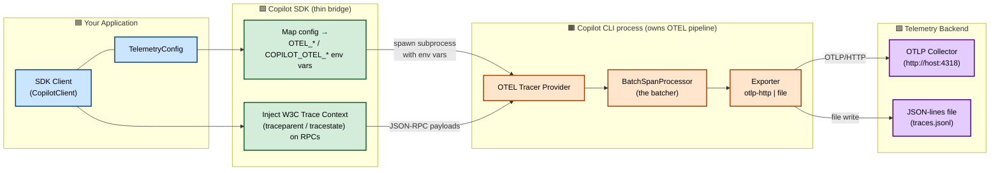
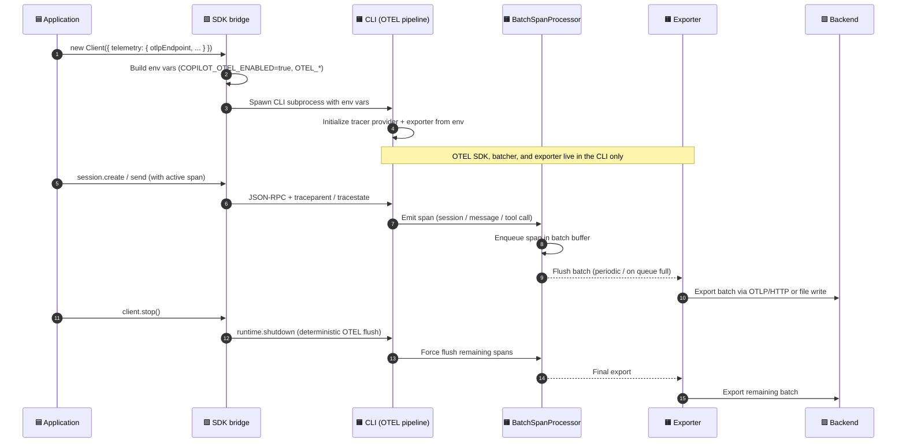
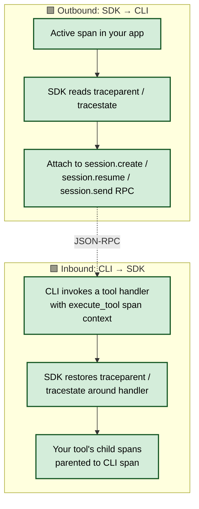

# OpenTelemetry (OTEL) Integration in the Copilot SDK

This document explains how OpenTelemetry is integrated across the Copilot SDK
language bindings, which components are involved, whether records are batched
before export, and whether any OTLP payload-size limits apply.

## TL;DR (answers to the key questions)

- **Where does the OTEL SDK live?** The language SDKs (Node.js, Python, Go,
  .NET, Java, Rust) **do not embed an OpenTelemetry SDK, batch processor, or
  exporter**. The actual OTEL pipeline (tracer provider, span processor,
  exporter) runs **inside the Copilot CLI process**. Each SDK is a thin
  _configuration bridge_: it translates a `TelemetryConfig` into environment
  variables that the CLI reads at startup, and it optionally propagates W3C
  Trace Context so your app's spans and the CLI's spans join one distributed
  trace.
- **Is a batcher used before the exporter?** Yes — but the batching happens in
  the **CLI**, not in the SDK. The CLI uses the standard OpenTelemetry
  `BatchSpanProcessor` (batch queue → periodic flush → exporter). None of the
  SDKs perform span batching themselves.
- **What is the max OTLP payload size?** **The SDK imposes no OTLP payload-size
  limit.** There is no size cap, batch-size setting, or queue-size setting
  anywhere in the SDK code. Payload size and batching are governed entirely by
  the CLI's OTEL configuration and standard OpenTelemetry defaults (see
  [OTLP payload size & batching](#otlp-payload-size--batching)).
- **Components used?** Exporter type (`otlp-http` or `file`), OTLP protocol
  (`http/json` or `http/protobuf`), and the CLI-side batch span processor. All
  are selected via `TelemetryConfig` fields that map to `OTEL_*` /
  `COPILOT_OTEL_*` environment variables.

## Architecture overview

The integration follows a **"configure, don't instrument"** model. Your
application configures telemetry through the SDK, but the telemetry data is
produced and exported by the CLI subprocess.

**Color legend**

- 🟦 **Blue — Your Application**: code you own; creates the client and supplies
  `TelemetryConfig`.
- 🟩 **Green — Copilot SDK**: the thin bridge. Two jobs: (1) turn config into
  environment variables, (2) propagate trace context. **No OTEL SDK, no
  batcher, no exporter here.**
- 🟧 **Orange — Copilot CLI**: the real OpenTelemetry pipeline lives here —
  tracer provider, **batch span processor (the batcher)**, and exporter.
- 🟪 **Purple — Backend**: where spans end up (OTLP collector or a local file).

## What each component does

| Component                        | Where it runs      | Role                                                                                                                                   |
| -------------------------------- | ------------------ | -------------------------------------------------------------------------------------------------------------------------------------- |
| `TelemetryConfig`                | Your app (via SDK) | Declarative config: endpoint, protocol, exporter type, source name, capture-content, file path.                                        |
| Env-var bridge                   | SDK                | Converts config fields into `OTEL_*` / `COPILOT_OTEL_*` variables set on the spawned CLI process.                                      |
| Trace-context propagation        | SDK                | Injects/extracts W3C `traceparent`/`tracestate` on `session.create`, `session.resume`, `session.send`, and inbound tool-call handling. |
| Tracer provider                  | CLI                | Creates spans for sessions, messages, and tool calls.                                                                                  |
| **BatchSpanProcessor (batcher)** | CLI                | **Queues spans and flushes them in batches to the exporter.**                                                                          |
| Exporter                         | CLI                | Emits batched spans over OTLP/HTTP (`otlp-http`) or writes JSON-lines (`file`).                                                        |

## Configuration → environment variable mapping

Every SDK maps the same `TelemetryConfig` fields to the same environment
variables. Setting any telemetry config also sets `COPILOT_OTEL_ENABLED=true`.

| Config field      | Environment variable                                 | Purpose                                                   |
| ----------------- | ---------------------------------------------------- | --------------------------------------------------------- |
| _(any field set)_ | `COPILOT_OTEL_ENABLED=true`                          | Turns on the CLI's OTEL pipeline.                         |
| OTLP endpoint     | `OTEL_EXPORTER_OTLP_ENDPOINT`                        | OTLP HTTP endpoint URL (e.g. `http://localhost:4318`).    |
| OTLP protocol     | `OTEL_EXPORTER_OTLP_PROTOCOL`                        | `http/json` or `http/protobuf`.                           |
| File path         | `COPILOT_OTEL_FILE_EXPORTER_PATH`                    | JSON-lines output path for the file exporter.             |
| Exporter type     | `COPILOT_OTEL_EXPORTER_TYPE`                         | `otlp-http` or `file`.                                    |
| Source name       | `COPILOT_OTEL_SOURCE_NAME`                           | Instrumentation scope name.                               |
| Capture content   | `OTEL_INSTRUMENTATION_GENAI_CAPTURE_MESSAGE_CONTENT` | `true`/`false`: capture prompt/response content on spans. |

Source references (env-var construction is identical in spirit across
languages):

- Node.js — [nodejs/src/client.ts](nodejs/src/client.ts#L2270-L2288)
- Go — [go/client.go](go/client.go#L1812-L1838)
- .NET — [dotnet/src/Client.cs](dotnet/src/Client.cs#L1962-L1972)
- Python — [python/copilot/\_telemetry.py](python/copilot/_telemetry.py)
- Rust — [rust/src/lib.rs](rust/src/lib.rs#L475-L505)

## Data flow: configuration and span export

> **Batching confirmation:** Step "Enqueue span in batch buffer" → "Flush batch"
> shows the batcher operating **inside the CLI**. The SDK never sees or buffers
> individual spans. On `client.stop()` the SDK issues `runtime.shutdown` so the
> CLI deterministically flushes any batched spans before the process exits
> (see the CHANGELOG note about calling `runtime.shutdown` during client stop
> for deterministic OTEL flush).

## Trace-context propagation flow

This is the **only** part of OTEL the SDK touches directly. It is optional and
used when you want your application's own spans to appear in the same trace as
the CLI's spans.

Source references:

- Node.js — [nodejs/src/telemetry.ts](nodejs/src/telemetry.ts)
- Go — [go/telemetry.go](go/telemetry.go)
- .NET — [dotnet/src/Telemetry.cs](dotnet/src/Telemetry.cs)
- Python — [python/copilot/\_telemetry.py](python/copilot/_telemetry.py)

## Per-language differences

The **configuration bridge is identical** across all six SDKs (same env vars,
same fields). The differences are entirely in **how trace context is
propagated** and **what OTEL dependency (if any) is required**.

| Language    | OTEL dependency                                       | Outbound propagation (SDK → CLI)                                                                | Inbound propagation (CLI → SDK)                                                                      |
| ----------- | ----------------------------------------------------- | ----------------------------------------------------------------------------------------------- | ---------------------------------------------------------------------------------------------------- |
| **Node.js** | None                                                  | **Manual** — provide `onGetTraceContext` callback that injects via `@opentelemetry/api`         | **Manual** — `traceparent`/`tracestate` exposed as raw strings on `ToolInvocation`; restore yourself |
| **Python**  | `opentelemetry-api` (extra: `copilot-sdk[telemetry]`) | **Automatic** — `propagate.inject` when OTel is configured                                      | **Automatic** — restored via `trace_context()` context manager                                       |
| **Go**      | `go.opentelemetry.io/otel` (required)                 | **Automatic** — global text-map propagator                                                      | **Automatic** — `ToolInvocation.TraceContext` is a ready-to-use `context.Context`                    |
| **.NET**    | None (built-in `System.Diagnostics.Activity`)         | **Automatic** — reads `Activity.Current`                                                        | **Automatic** — `RestoreTraceContext()` sets the parent Activity                                     |
| **Java**    | `io.opentelemetry:opentelemetry-api`                  | **Automatic** when the OTel Java agent/SDK is configured (config-only otherwise)                | Trace context available on generated event/RPC types                                                 |
| **Rust**    | None                                                  | **Explicit** — pass a `TraceContext` on `SessionConfig` (`TraceContext::from_traceparent(...)`) | Trace context surfaced on tool invocations                                                           |

Notable callouts:

- **No SDK bundles an OTEL exporter or batcher.** Even Go and Python, which take
  an OTEL dependency, use it _only_ for W3C context propagation — not for
  exporting spans.
- **Node.js and Rust are fully manual/explicit** for propagation; they take no
  OTEL dependency at all.
- **.NET is the only "batteries-included" option** for propagation with zero
  added dependencies (uses the built-in `System.Diagnostics.Activity`).
- **The `otlpProtocol` field** (`http/json` vs `http/protobuf`) is available in
  all languages and only affects the CLI's OTLP exporter — it does not change
  SDK behavior.

## OTLP payload size & batching

This section directly answers the "max OTLP payload" and "does it batch"
questions.

### Does the SDK limit OTLP payload size?

**No.** There is no OTLP payload-size limit, batch-size setting, or queue-size
setting anywhere in the SDK source. The SDK never constructs, buffers, or sends
OTLP payloads itself — it only sets environment variables and hands off to the
CLI. Consequently:

- **The SDK cannot and does not cap OTLP payload size.**
- Payload size is a function of how many spans the CLI batches together and how
  large each span is (which grows when `captureContent=true`, since prompts and
  responses are attached to spans).

### Where batching and any limits actually come from

Batching and size limits are governed by the **CLI's OTEL pipeline** and the
**standard OpenTelemetry defaults / the receiving collector**:

| Concern                    | Governed by                                                   | Typical default (OpenTelemetry)                                   |
| -------------------------- | ------------------------------------------------------------- | ----------------------------------------------------------------- |
| Whether spans are batched  | CLI `BatchSpanProcessor`                                      | Yes — batching is on                                              |
| Max spans per export batch | CLI batch processor config (`OTEL_BSP_MAX_EXPORT_BATCH_SIZE`) | 512 spans                                                         |
| Max queued spans           | CLI batch processor config (`OTEL_BSP_MAX_QUEUE_SIZE`)        | 2048 spans                                                        |
| Export flush interval      | CLI batch processor config (`OTEL_BSP_SCHEDULE_DELAY`)        | 5000 ms                                                           |
| Export timeout             | `OTEL_EXPORTER_OTLP_TIMEOUT`                                  | 10000 ms                                                          |
| Max accepted request size  | The **receiving OTLP collector/backend**                      | Commonly ~4 MiB for gRPC receivers; configurable on the collector |

> These are the standard OpenTelemetry SDK defaults that the CLI inherits — they
> are **not defined in this repository**. The Copilot SDK exposes none of these
> batch/size knobs through `TelemetryConfig`. To tune them, set the standard
> `OTEL_BSP_*` / `OTEL_EXPORTER_OTLP_*` environment variables on the CLI process
> (the SDK passes the process environment through), or configure limits on your
> collector.

### Practical guidance

- If you expect large payloads (for example with `captureContent=true`),
  configure your **collector** to accept larger requests rather than looking for
  a limit in the SDK — the SDK has none.
- To reduce payload size, leave `captureContent` unset/`false` so prompt and
  response bodies are not attached to spans.
- Batches flush automatically on the CLI's schedule and are force-flushed on
  `client.stop()` via `runtime.shutdown`, so short-lived processes still export
  their spans.

## Configurable OTLP / telemetry settings

There are **two tiers** of configuration:

1. **SDK-native `TelemetryConfig` settings** — first-class fields exposed by
   every SDK. These are the settings the SDK explicitly supports and maps to
   environment variables.
2. **Standard OTEL pass-through environment variables** — the CLI honors the
   full set of standard `OTEL_*` variables. The SDK does not expose these as
   config fields, but it passes the process environment through to the CLI, so
   you can set them yourself.

### Tier 1 — SDK-native `TelemetryConfig` settings

> **Language applicability:** every setting below is supported in **all six
> languages** (Node.js, Python, Go, .NET, Java, Rust). Only the **field name
> casing** differs per language; the underlying environment variable and CLI
> behavior are identical. **No SDK-native OTLP setting is exclusive to a single
> language.**

| Setting                     | Environment variable                                 | Applicable languages | Node.js                       | Python            | Go               | .NET             | Java             | Rust              |
| --------------------------- | ---------------------------------------------------- | -------------------- | ----------------------------- | ----------------- | ---------------- | ---------------- | ---------------- | ----------------- |
| Enable telemetry (implicit) | `COPILOT_OTEL_ENABLED=true`                          | All                  | _(auto when `telemetry` set)_ | _(auto)_          | _(auto)_         | _(auto)_         | _(auto)_         | _(auto)_          |
| OTLP endpoint               | `OTEL_EXPORTER_OTLP_ENDPOINT`                        | All                  | `otlpEndpoint`                | `otlp_endpoint`   | `OTLPEndpoint`   | `OtlpEndpoint`   | `otlpEndpoint`   | `otlp_endpoint`   |
| OTLP protocol               | `OTEL_EXPORTER_OTLP_PROTOCOL`                        | All                  | `otlpProtocol`                | `otlp_protocol`   | `OTLPProtocol`   | `OtlpProtocol`   | `otlpProtocol`   | `otlp_protocol`   |
| Exporter type               | `COPILOT_OTEL_EXPORTER_TYPE`                         | All                  | `exporterType`                | `exporter_type`   | `ExporterType`   | `ExporterType`   | `exporterType`   | `exporter_type`   |
| File exporter path          | `COPILOT_OTEL_FILE_EXPORTER_PATH`                    | All                  | `filePath`                    | `file_path`       | `FilePath`       | `FilePath`       | `filePath`       | `file_path`       |
| Source (scope) name         | `COPILOT_OTEL_SOURCE_NAME`                           | All                  | `sourceName`                  | `source_name`     | `SourceName`     | `SourceName`     | `sourceName`     | `source_name`     |
| Capture GenAI content       | `OTEL_INSTRUMENTATION_GENAI_CAPTURE_MESSAGE_CONTENT` | All                  | `captureContent`              | `capture_content` | `CaptureContent` | `CaptureContent` | `captureContent` | `capture_content` |

**Accepted values**

- **OTLP protocol**: `http/json` or `http/protobuf`. Applies to all signals on
  the CLI's `otlp-http` exporter.
- **Exporter type**: `otlp-http` (export over OTLP/HTTP) or `file` (write
  JSON-lines). When `file`, set the file exporter path.
- **Capture GenAI content**: `true` / `false`. When `true`, prompt and response
  bodies are attached to spans (increases payload size).

### Tier 2 — Standard OTEL pass-through environment variables

These are **not** `TelemetryConfig` fields and are **not language-specific** —
they are process environment variables read by the CLI's OpenTelemetry SDK. Set
them on the environment of the process that spawns the CLI (or via the SDK's
`env` option where available). They apply uniformly regardless of SDK language.

| Setting                      | Environment variable                 | Applicable languages | Notes                                                      |
| ---------------------------- | ------------------------------------ | -------------------- | ---------------------------------------------------------- |
| Exporter headers (e.g. auth) | `OTEL_EXPORTER_OTLP_HEADERS`         | All (pass-through)   | Comma-separated `key=value` pairs sent with OTLP requests. |
| Export timeout               | `OTEL_EXPORTER_OTLP_TIMEOUT`         | All (pass-through)   | Milliseconds; default `10000`.                             |
| Traces-only endpoint         | `OTEL_EXPORTER_OTLP_TRACES_ENDPOINT` | All (pass-through)   | Overrides the endpoint for the traces signal only.         |
| TLS certificate              | `OTEL_EXPORTER_OTLP_CERTIFICATE`     | All (pass-through)   | Path to trusted CA cert for the collector.                 |
| Batch queue size             | `OTEL_BSP_MAX_QUEUE_SIZE`            | All (pass-through)   | Max spans buffered; default `2048`.                        |
| Batch export size            | `OTEL_BSP_MAX_EXPORT_BATCH_SIZE`     | All (pass-through)   | Max spans per export; default `512`.                       |
| Batch schedule delay         | `OTEL_BSP_SCHEDULE_DELAY`            | All (pass-through)   | Flush interval in ms; default `5000`.                      |
| Batch export timeout         | `OTEL_BSP_EXPORT_TIMEOUT`            | All (pass-through)   | Per-export timeout in ms; default `30000`.                 |
| Sampler                      | `OTEL_TRACES_SAMPLER`                | All (pass-through)   | e.g. `parentbased_always_on`, `traceidratio`.              |
| Sampler argument             | `OTEL_TRACES_SAMPLER_ARG`            | All (pass-through)   | e.g. ratio for `traceidratio`.                             |
| Resource attributes          | `OTEL_RESOURCE_ATTRIBUTES`           | All (pass-through)   | `key=value` list merged onto the resource.                 |
| Service name                 | `OTEL_SERVICE_NAME`                  | All (pass-through)   | Sets `service.name` on the resource.                       |

> **Important:** Tier 2 variables are honored by the **CLI's** OpenTelemetry
> SDK, not by the language SDK. They are documented here for completeness (for
> example, this is how you would raise batch/queue limits or add auth headers),
> but they are **not exposed or validated** by `TelemetryConfig`. Their defaults
> and semantics are the standard OpenTelemetry ones, not defined in this repo.

### Language-specific behavior (recap)

No OTLP **setting** is language-specific, but two **behaviors** differ by
language (covered in [Per-language differences](#per-language-differences)):

- **Trace-context propagation** (manual vs automatic vs explicit).
- **OTEL dependency requirement** (none / `opentelemetry-api` / required).

## References

- Guide: [docs/observability/opentelemetry.md](docs/observability/opentelemetry.md)
- Getting started (telemetry section): [docs/getting-started.md](docs/getting-started.md)
- OpenTelemetry GenAI semantic conventions: <https://opentelemetry.io/docs/specs/semconv/gen-ai/>
- OpenTelemetry BatchSpanProcessor & OTLP exporter env vars:
  <https://opentelemetry.io/docs/specs/otel/configuration/sdk-environment-variables/>
